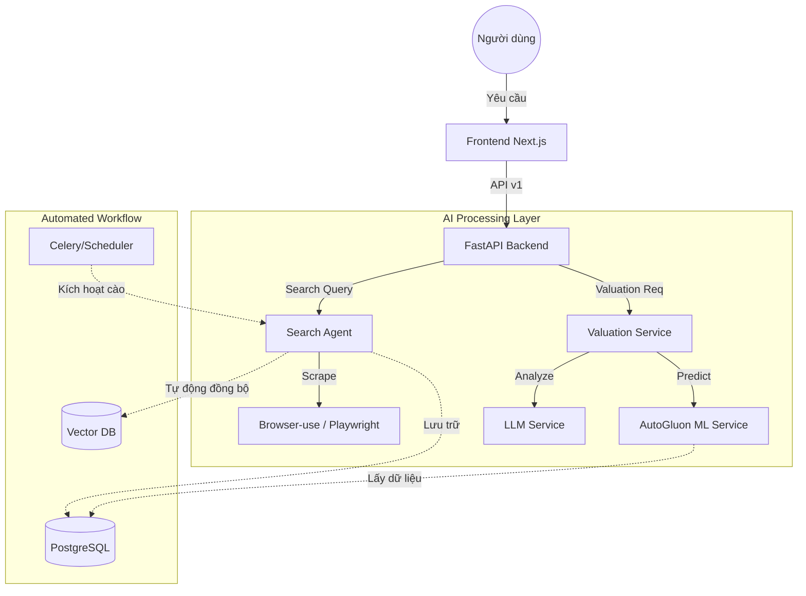

# 🏠 BDS Agent - Hệ Thống Tìm Kiếm & Phân Tích Bất Động Sản AI

Hệ thống AI chuyên nghiệp tự động thu thập (scrape), phân tích và định giá bất động sản. Sử dụng công nghệ Agentic AI với khả năng tự phục hồi và tối ưu hóa dữ liệu.

---

## 🏛️ Kiến Trúc Hệ Thống (System Architecture)

Dự án được thiết kế theo hướng **Modular Monolith**, đảm bảo tính tách biệt giữa các service nhưng vẫn dễ dàng triển khai.

### 1. Sơ đồ luồng dữ liệu (Data Flow)



### 2. Chi tiết các Module

#### 🤖 AI Scraper Agent (`agents/`)
- **Web Intelligence**: Sử dụng `browser-use` tích hợp LLM để "đọc" và "hiểu" cấu trúc trang web bất động sản (Batdongsan.com.vn, Chotot).
- **Vượt rào cản**: Cơ chế tự động xử lý Captcha và thay đổi User-Agent để tránh bị block.
- **Data Cleaner**: Tự động chuyển đổi các đơn vị giá (tỷ, triệu/m2, thỏa thuận) về số nguyên chuẩn để tính toán.

#### 📈 Machine Learning Service (`services/ml_service.py`)
- **AutoGluon Backbone**: Sử dụng framework AutoML của Amazon để tự động chọn ra model tốt nhất (XGBoost, LightGBM, CatBoost).
- **Online Training**: Hệ thống có khả năng tự động train lại model (Retraining) khi lượng dữ liệu mới trong Database đạt ngưỡng nhất định.
- **Feature Engineering**: Tự động xử lý các đặc trưng như: Quận/Huyện, Loại nhà, Hướng, Số phòng để đưa ra dự báo chính xác nhất.

#### 🧠 LLM Service & Resilient Logic (`services/llm_service.py`)
- **Hybrid AI**: 
    - **Primary**: Google Gemini 2.0 Flash (Tốc độ cao, suy luận tốt).
    - **Fallback**: Ollama (Qwen 2.5 1.5B) - Hoạt động ngay cả khi không có mạng hoặc hết quota API.
- **JSON Enforcement**: Đảm bảo AI luôn trả về cấu trúc dữ liệu chuẩn dù đang ở chế độ dự phòng.

#### 💾 Database & Vector Search
- **PostgreSQL**: Lưu trữ dữ liệu quan hệ, lịch sử định giá và thông tin tin đăng.
- **ChromaDB**: Lưu trữ các bản nhúng (Embeddings) của tin đăng, cho phép tìm kiếm theo ý nghĩa: *"Tìm nhà giống căn ở Cầu Giấy nhưng giá rẻ hơn"*.

---

## � Hướng Dẫn Phát Triển (Developer Guide)

### Cách thêm một trang cào dữ liệu mới:
1. Tạo một class kế thừa từ `BaseCrawler` trong `agents/`.
2. Định nghĩa logic trích xuất thông tin (Title, Price, Area).
3. Đăng ký crawler trong `SearchAgent`.

### Cách chạy thử nghiệm các tính năng:
- **Test Scraper**: `python debug_scraper.py`
- **Test ML Connection**: `python debug_analytics_data.py`

---

## 🎨 Giao Diện Hệ Thống (UI Design)

Hệ thống sử dụng ngôn ngữ thiết kế **Space AI**:
- **Background**: Deep Space Blue với hiệu ứng Radial Glow (Spotlight).
- **Typography**: Kết hợp phông chữ Inter và hệ thống icon Lucide chuyên nghiệp.
- **Responsive**: Tương thích hoàn toàn với Mobile và Tablet.

---

## 📋 Yêu Cầu Cài Đặt

1.  **Python 3.11+**
2.  **Node.js 18+** (Frontend Next.js)
3.  **Docker Desktop** (Cho PostgreSQL & Redis)
4.  **Ollama** (Bắt buộc cho cơ chế Fallback AI)

---

## 🚀 Hướng Dẫn Cài Đặt

### Bước 1: Backend
```powershell
python -m venv .venv
.\.venv\Scripts\activate
pip install -r requirements.txt
playwright install chromium
```

### Bước 2: Frontend
```powershell
cd frontend
npm install
```

### Bước 3: Cấu hình (.env)
Copy file `.env.example` thành `.env` và cập nhật:
- `GEMINI_API_KEY`: Key của Google AI.
- `DATABASE_URL`: Kết nối tới Postgres (mặc định trong Docker).

---

## ▶️ Khởi Động Hệ Thống

### 1. Database (Docker)
```powershell
docker-compose up -d
```

### 2. Backend API
```powershell
python main.py api
```
*API Docs: `http://localhost:8000/docs` (Endpoint v1: `/api/v1/...`)*

### 3. Frontend Web
```powershell
cd frontend
npm run dev
```
*Truy cập: `http://localhost:3000`*

---

## 🛠️ Công Cụ Hữu Ích

- **Cào dữ liệu hàng loạt**: `python bulk_scrape.py`
- **Tìm kiếm tương tác (CLI)**: `python main.py interactive`
- **Chế độ Demo**: `python main.py demo`

---

## ⚠️ Giải Quyết Sự Cố (Troubleshooting)

1.  **Định giá hiện N/A?**
    *   Kiểm tra xem Postgres đã bật chưa (`docker-compose up -d`).
    *   Hệ thống sẽ dùng AutoML dự phòng nếu AI gặp sự cố.
2.  **Chatbot không trả lời?**
    *   Đảm bảo Ollama đang chạy (`ollama serve`) để cơ chế Fallback hoạt động.
3.  **Lỗi kết nối database (WinError 1225)?**
    *   PostgreSQL đang bị tắt hoặc cổng 5432 bị chiếm.

---

**Phát triển bởi**: NHÓM 5 - VSMAC 

