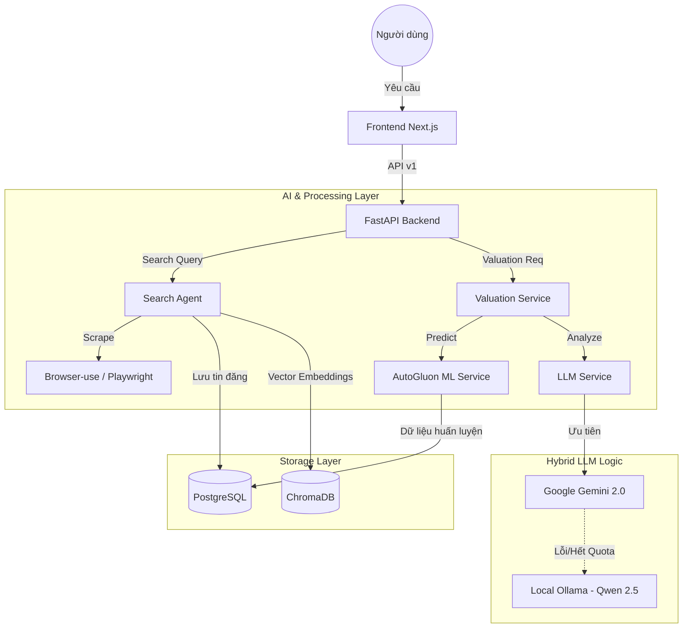

# 🏠 BDS Agent - Hệ Thống Tìm Kiếm & Phân Tích Bất Động Sản AI

Hệ thống AI chuyên nghiệp tự động thu thập (scrape), phân tích và định giá bất động sản. Sử dụng công nghệ Agentic AI với khả năng tự phục hồi và tối ưu hóa dữ liệu.

---

## �️ Kiến Trúc Hệ Thống (System Architecture)

Hệ thống được xây dựng theo kiến trúc Micro-services đơn giản (Modular Monolith) với sự kết hợp giữa xử lý ngôn ngữ tự nhiên (LLM) và học máy truyền thống (ML).

### 1. Sơ đồ luồng dữ liệu (Data Flow)



### 2. Các thành phần chính

- **Search Agent**: Sử dụng `browser-use` để điều khiển trình duyệt như người thật, tự động vượt qua các lớp bảo mật để thu thập dữ liệu bất động sản từ Batdongsan, Chợ Tốt.
- **LLM Service (Resilient Layer)**: Đóng vai trò bộ não. Sử dụng cơ chế Fallback độc đáo. Nếu API đám mây (Gemini) gặp sự cố, hệ thống tự động gọi Ollama chạy ngay trên máy của bạn để xử lý chat và phân tích JSON.
- **ML Service (Valuation)**: Sử dụng **AutoGluon** để huấn luyện mô hình dự báo giá dựa trên dữ liệu thực tế đã cào được. Đây là con số tham chiếu khách quan bên cạnh phân tích của LLM.
- **Vector Database (ChromaDB)**: Chuyển đổi thông tin tin đăng thành các vector không gian, cho phép tìm kiếm theo ngữ nghĩa (Semantic Search) thay vì chỉ tìm theo từ khóa.

---

## 🌟 Tính Năng Nổi Bật

- **Hybrid AI Fallback**: Đảm bảo hệ thống không bao giờ "chết" khi mất internet hoặc hết tiền API.
- **AutoML Integration**: Tự động huấn luyện lại mô hình định giá hàng ngày khi có dữ liệu mới.
- **Semantic Search**: Tìm kiếm thông minh: "Mua nhà cho người thích yên tĩnh, gần hồ" thay vì chỉ "mua nhà Tây Hồ".
- **Professional UI**: Giao diện tối ưu cho trải nghiệm người dùng với tone màu Slate hiện đại, dịu mắt.

---

## 📂 Cấu Trúc Thư Mục

- `/api`: Chứa các routes FastAPI, logic xử lý API v1.
- `/agents`: Các Agent thông minh xử lý cào dữ liệu và tìm kiếm.
- `/services`: Chứa logic nghiệp vụ chính (LLM, ML, Valuation).
- `/storage`: Cấu hình Database (PostgreSQL) và Vector DB (ChromaDB).
- `/frontend`: Mã nguồn giao diện Next.js 14+ với TailwindCSS và ShadcnUI.
- `/scheduler`: Các tác vụ chạy ngầm (tự động cào dữ liệu, tự động huấn luyện lại model).

---

## 📋 Yêu Cầu Hệ Thống

1.  **Python 3.11+**
2.  **Node.js 18+** (Frontend Next.js)
3.  **Docker Desktop** (Cho PostgreSQL & Redis)
4.  **Ollama** (Bắt buộc cho cơ chế Fallback AI)

---

## 🚀 Hướng Dẫn Cài Đặt

### Bước 1: Backend
```powershell
python -m venv .venv
.\.venv\Scripts\activate
pip install -r requirements.txt
playwright install chromium
```

### Bước 2: Frontend
```powershell
cd frontend
npm install
```

### Bước 3: Cấu hình (.env)
Copy file `.env.example` thành `.env` và cập nhật:
- `GEMINI_API_KEY`: Key của Google AI.
- `DATABASE_URL`: Kết nối tới Postgres (mặc định trong Docker).

---

## ▶️ Khởi Động Hệ Thống

### 1. Database (Docker)
```powershell
docker-compose up -d
```

### 2. Backend API
```powershell
python main.py api
```
*API Docs: `http://localhost:8000/docs` (Endpoint v1: `/api/v1/...`)*

### 3. Frontend Web
```powershell
cd frontend
npm run dev
```
*Truy cập: `http://localhost:3000`*

---

## 🛠️ Công Cụ Hữu Ích

- **Cào dữ liệu hàng loạt**: `python bulk_scrape.py`
- **Tìm kiếm tương tác (CLI)**: `python main.py interactive`
- **Chế độ Demo**: `python main.py demo`

---

## ⚠️ Giải Quyết Sự Cố (Troubleshooting)

1.  **Định giá hiện N/A?**
    *   Kiểm tra xem Postgres đã bật chưa (`docker-compose up -d`).
    *   Hệ thống sẽ dùng AutoML dự phòng nếu AI gặp sự cố.
2.  **Chatbot không trả lời?**
    *   Đảm bảo Ollama đang chạy (`ollama serve`) để cơ chế Fallback hoạt động.
3.  **Lỗi kết nối database (WinError 1225)?**
    *   PostgreSQL đang bị tắt hoặc cổng 5432 bị chiếm.

---

**Phát triển bởi**: Antigravity Team

