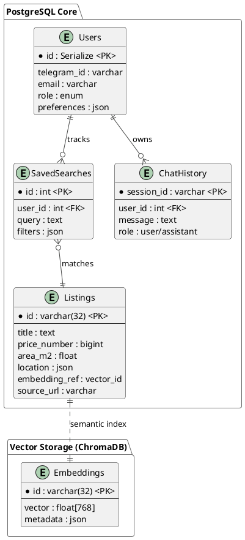

# 📄 Báo Cáo Phân Tích Hệ Thống BDS Agent

Bản báo cáo này cung cấp cái nhìn chi tiết về kiến trúc, công thức, quy trình hoạt động và các kiến thức cốt lõi được sử dụng trong hệ thống **BDS Agent**.

---

## 1. Kiến Trúc Hệ Thống (System Architecture)

Hệ thống được xây dựng theo kiến trúc **Decoupled Monolith** với các thành phần chính sau:

-   **Frontend (Next.js 14)**: Giao diện người dùng hiện đại, sử dụng React Query để quản lý state và Recharts để vẽ biểu đồ analytics.
-   **Backend (FastAPI)**: REST API hiệu năng cao, xử lý yêu cầu tìm kiếm, quản lý dữ liệu và tích hợp AI Agent.
-   **AI Agent (Browser-use + LangChain)**: "Trái tim" của hệ thống, sử dụng mô hình **Hybrid (Gemini + Ollama)** để xử lý ngôn ngữ tự nhiên và trích xuất dữ liệu thông minh.
-   **Database (PostgreSQL)**: Lưu trữ dữ liệu có cấu trúc (Tin đăng, User, Logs).
-   **Vector Database (ChromaDB)**: Lưu trữ các bản nhúng (embeddings) của tin đăng để thực hiện **Tìm kiếm ngữ nghĩa (Semantic Search)**.
-   **Scheduler (APScheduler)**: Quản lý các tác vụ chạy ngầm định kỳ (Scrape tự động, dọn dẹp dữ liệu).

---

## 2. Các Chức Năng Chính (Core Features)

1.  **AI Scraper Real-time**: Tìm kiếm và trích xuất dữ liệu trực tiếp khi người dùng yêu cầu.
2.  **Semantic Search**: Tìm kiếm tin đăng dựa trên ý nghĩa (ví dụ: tìm "nhà gần hồ" sẽ ra kết quả ở Tây Hồ/Hoàn Kiếm dù tin không chứa từ "hồ").
3.  **Analytics Dashboard**: Phân tích xu hướng giá, phân bổ tin đăng theo quận và nguồn (platform).
4.  **Validation Engine**: Kiểm định chất lượng dữ liệu tự động, loại bỏ tin ảo/spam.
5.  **Telegram Notification**: Gửi thông báo ngay lập tức khi có tin đăng mới khớp với nhu cầu người dùng.
6.  **AI Chat Assistant**: Trợ lý ảo tư vấn BĐS 24/7, trả lời câu hỏi dựa trên data thực (RAG).
7.  **AI Valuation**: Hệ thống định giá tự động dựa trên Big Data và so sánh tương đồng.

---

## 3. Kiến Thức & Quy Tắc Cốt Lõi (Domain Knowledge)

Hệ thống tích hợp sẵn các kiến thức chuyên môn về BĐS Việt Nam:

### Phân Loại Loại Hình BĐS
Hệ thống chuẩn hóa dữ liệu về 5 loại hình chính:
- **Chung cư**: Căn hộ, tập thể.
- **Nhà riêng**: Nhà ngõ, townhouse.
- **Biệt thự**: Villa.
- **Đất nền**: Đất thổ cư, đất dự án.
- **Nhà mặt phố**: Nhà shophouse, mặt đường kinh doanh.

### Quy Tắc Kiểm Định Số Điện Thoại
- Làm sạch các ký tự đặc biệt, đưa về đầu số `0` chuẩn.
- Gắn cờ cảnh báo nếu một số điện thoại xuất hiện > 50 lần/ngày (dấu hiệu môi giới/spam).

---

## 4. Công Thức & Logic Xử Lý (Core Formulas)

### 4.1. Công Thức Giá (Price Formulas)
- **Đơn giá/m²**: `price_per_m2 = total_price / area_m2`.
- **Ngưỡng giá theo Quận (Hà Nội)**: Hệ thống sử dụng bảng dữ liệu giá sàn/trần để phát hiện tin đăng có giá bất thường.
  *   *Ví dụ*: Cầu Giấy (60 - 180tr/m²), Hoàn Kiếm (100 - 300tr/m²).
  *   *Logic*: Nếu `price_per_m2 < min_district_price * 0.3`, hệ thống đánh dấu là "Tin có dấu hiệu ảo".

### 4.2. Chống Trùng Lặp (Deduplication)
Sử dụng hàm băm MD5 để tạo định danh duy nhất (Fingerprint) cho mỗi tin đăng:
`Listing_ID = MD5(URL_nguồn + SĐT_làm_sạch + Tiêu_đề_chuẩn_hóa)`

### 4.3. Tìm Kiếm Ngữ Nghĩa (Vector Similarity)
Sử dụng mô hình `paraphrase-multilingual-MiniLM-L12-v2` để chuyển văn bản thành vector.
- **Độ tương đồng**: Tính toán dựa trên **L2 Distance** (khoảng cách Euclidean). 
- **Similarity Score**: Chuyển đổi về khoảng [0, 1] bằng công thức: `Score = 1 / (1 + Distance)`.

### 4.4. Logic Định Giá (AI Valuation Logic)
- **Phương pháp**: So sánh dòng tiền & So sánh trực tiếp (Comparative Market Analysis - CMA).
- **Thuật toán**: K-Nearest Neighbors (KNN) biến thể.
  1. Tìm 10-20 tin đăng "hàng xóm" có cùng: Quận, Phân khúc, Số phòng ngủ.
  2. Tính điểm tương đồng (Weight) dựa trên: Khoảng cách diện tích, vị trí.
  3. **Giá ước tính** = Average (Giá các tin hàng xóm * Weight).

### 4.4. Logic Định Giá (AI Valuation Logic)
- **Phương pháp**: So sánh dòng tiền & So sánh trực tiếp (Comparative Market Analysis - CMA).
- **Thuật toán**: K-Nearest Neighbors (KNN) biến thể.
  1. Tìm 10-20 tin đăng "hàng xóm" có cùng: Quận, Phân khúc, Số phòng ngủ.
  2. Tính điểm tương đồng (Weight) dựa trên: Khoảng cách diện tích, vị trí.
  3. **Giá ước tính** = Average (Giá các tin hàng xóm * Weight).

---

## 5. Luồng Hoạt Động (Workflows)

### 5.1. Luồng Tìm Kiếm Thủ Công (Manual Search)
1. Người dùng nhập query (VD: "Tìm nhà Ba Đình dưới 5 tỷ").
2. **Hệ thống ưu tiên dùng Gemini** để phân tích ý định (Intent) → Trích xuất: `Quận: Ba Đình, Giá Max: 5.000.000.000`.
3. **Cơ chế Fallback**: Nếu Gemini lỗi (hết lượt dùng/mất mạng), hệ thống tự động chuyển sang **Ollama (Local)** để xử lý tiếp mà không bị gián đoạn.
4. Hệ thống tìm trong Database + Vector DB trước.
5. Nếu data cũ/thiếu → AI Agent khởi động trình duyệt → Scrape tin mới từ các nền tảng BĐS.
6. Data được chuẩn hóa qua **Validator** → Lưu DB → Trả về cho User.

### 5.2. Luồng Chạy Ngầm Tự Động (Scheduler)
1. Cứ mỗi **4 giờ**: Hệ thống tự động scrape các keyword phổ biến để làm giàu database.
2. Cứ mỗi **24 giờ**: Chạy job `cleanup` để loại bỏ/ẩn các tin đăng đã quá 30 ngày.
3. Cứ mỗi **1 giờ**: Hệ thống so sánh tin mới scrape được với các "Tìm kiếm đã lưu" của User để gửi thông báo Telegram.

---
## 6. Mô Hình AI Kết Hợp (Hybrid LLM Architecture)

Hệ thống sử dụng chiến lược **Hybrid** để tối ưu hóa giữa hiệu năng và độ tin cậy:

| Thành phần | Vai trò | Ưu điểm |
| :--- | :--- | :--- |
| **Gemini (Primary)** | Brain chính xử lý Parser & Extract | Chạy cực nhanh, độ chính xác cao, hiểu ngữ cảnh phức tạp. |
| **Ollama (Fallback)** | Dự phòng khi Gemini gặp sự cố | Chạy offline, không tốn phí, đảm bảo hệ thống luôn hoạt động (Low-latency/No-internet). |
| **Sentence-BERT** | Tạo Vector Embeddings | Chuyên biệt cho tiếng Việt để tìm kiếm ngữ nghĩa chính xác. |
| **Browser-use** | Tự động hóa trình duyệt | Điều khiển Playwright vượt qua các cơ chế chống bot phức tạp. |

---

## 7. Chi Tiết Kỹ Thuật & Lý Thuyết Cốt Lõi

Để vận hành hệ thống một cách tối ưu, bạn cần hiểu rõ 3 nền tảng trụ cột sau:

### 7.1. Docker - Containerization (Đóng gói ứng dụng)
**Lý thuyết**: Docker là nền tảng ảo hóa cho phép đóng gói toàn bộ môi trường phần mềm (OS, thư viện, cấu hình) vào một "Container" duy nhất.
- **Trong hệ thống này**: Docker giúp bạn khởi chạy Database (PostgreSQL), Bộ nhớ đệm (Redis) và Cơ sở dữ liệu vector (ChromaDB) chỉ bằng 1 lệnh duy nhất (`docker-compose up`).
- **Lợi ích**: Đảm bảo "chạy được trên máy tôi là chạy được trên máy bạn", không bao giờ bị lỗi do cài đặt môi trường database sai cách.

### 7.2. browser-use - AI-Automated Browsing
**Lý thuyết**: Đây là một framework tiên tiến kết hợp giữa **Playwright** (tự động hóa trình duyệt) và **LLM** (trí tuệ nhân tạo).
- **Điểm khác biệt**: Thay vì bạn phải viết code CSS Selector cứng nhắc (`div.price`) - vốn rất dễ bị hỏng khi website đổi giao diện - `browser-use` sử dụng AI để "nhìn" trang web và tự bấm nút, tìm kiếm như một con người.
- **Trong hệ thống này**: Nó chịu trách nhiệm vượt qua các cơ chế chống bot (anti-bot) của các trang BĐS lớn và trích xuất dữ liệu một cách thông minh, linh hoạt.

### 7.3. Cơ chế Hybrid Fallback (Gemini & Ollama)
**Lý thuyết**: Đây là mô hình kết hợp (Hybrid) giữa Cloud AI và Local AI để đảm bảo tính sẵn sàng cao nhất.
- **Hoạt động thực tế**:
  - **Ưu tiên dùng Gemini**: Được sử dụng cho các tác vụ cần độ chuẩn xác cao và phản hồi nhanh.
  - **Tự động chuyển sang Ollama**: Khi Gemini gặp lỗi (như hết tiền trong API, mất mạng, hoặc bị chặn/rate limit), hệ thống sẽ tự động kích hoạt "bộ não dự phòng" Ollama chạy trực tiếp trên máy.
- **Lợi ích**: Đảm bảo trải nghiệm người dùng không bao giờ bị gián đoạn, tối ưu chi phí (chỉ dùng Cloud khi cần thiết) và bảo mật dữ liệu nhạy cảm.

---
## 8. Phân Tích Lưu Trữ Dữ Liệu (Data Storage Analysis)

### 8.1. Ước Tính Dung Lượng (Capacity Planning)
Dựa trên cấu trúc dữ liệu hiện tại, ta có bảng ước tính dung lượng cho **1,000,000 tin đăng** (quy mô trung bình lớn):

| Loại Dữ Liệu | Kích thước trung bình/record | Số lượng dự kiến | Tổng dung lượng | Ghi chú |
| :--- | :--- | :--- | :--- | :--- |
| **Listing Meta** | ~2 KB | 1,000,000 | ~2 GB | Title, Description, Price, Attributes |
| **Vector Embeddings** | ~3 KB | 1,000,000 | ~3 GB | 768 dimensions (float32) |
| **Images** | 0 KB | 1,000,000 | 0 GB | Chỉ lưu URL, ảnh lưu tại CDN nguồn |
| **Scrape Logs** | ~0.5 KB | 5,000/ngày | ~1 GB/năm | Logs hoạt động cào dữ liệu |
| **Chat History** | ~1 KB | 1,000/ngày | ~0.4 GB/năm | Lịch sử chat với AI |
| **Tổng Cộng** | | | **~6.5 GB** | PostgreSQL + ChromaDB |

### 8.2. Sơ Đồ Cấu Trúc Dữ Liệu (PlantUML ERD)
Dưới đây là mã PlantUML để vẽ sơ đồ quan hệ thực thể (ERD) cho hệ thống Database hiện tại:

### 8.3. Chiến Lược Lưu Trữ & Backup
1.  **Hot Data (Dữ liệu nóng)**: Tin đăng Active trong 30 ngày gần nhất -> Lưu trên SSD tốc độ cao của Database Server để truy vấn nhanh.
2.  **Cold Data (Dữ liệu nguội)**: Tin đăng > 60 ngày hoặc đã bán -> Archive sang bảng lịch sử hoặc partition riêng giá rẻ.
3.  **Vector Index**: Chỉ lưu embeddings của các tin Active để tối ưu tốc độ tìm kiếm ngữ nghĩa (Semantic Search).

---
*Báo cáo được tổng hợp tự động dựa trên cấu trúc hiện tại của dự án.*

